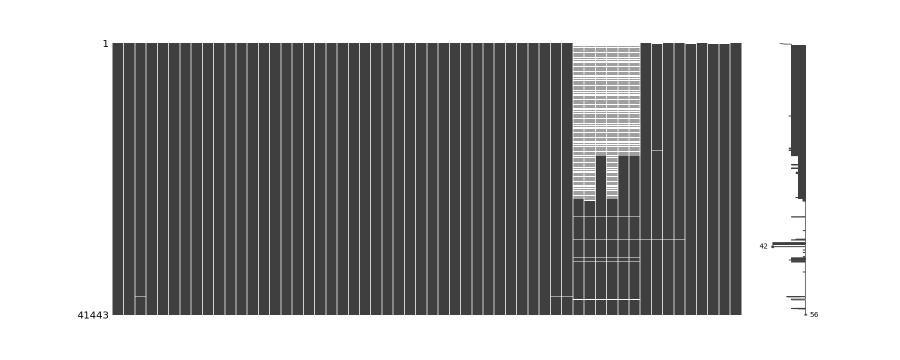
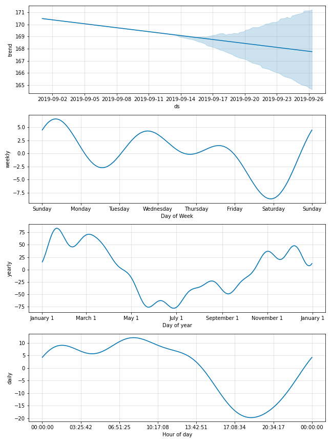
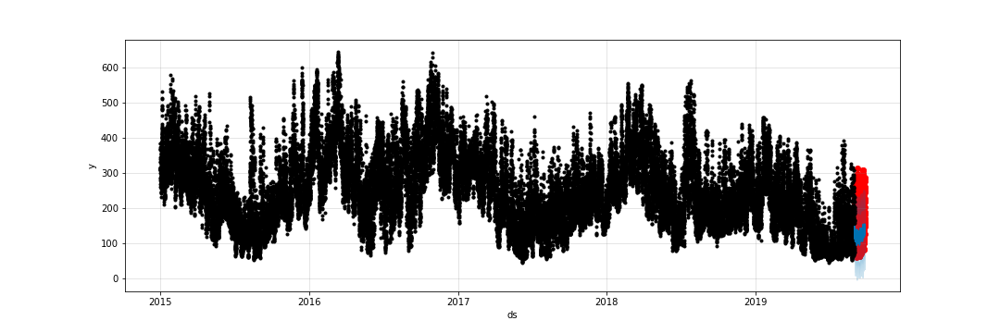
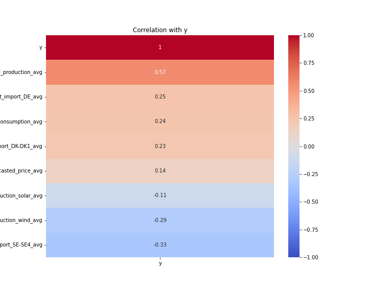
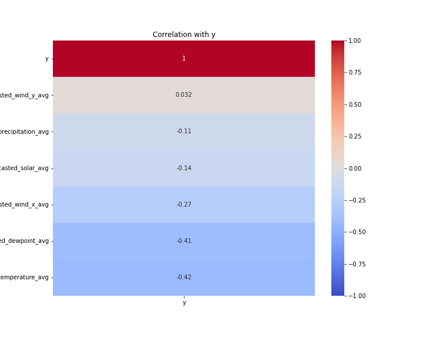

# TL;DR

CarbonForecastDK2 forecasts carbon intensity in Eastern Denmark (DK-DK2) for the next 24 hours using Prophet.

Based on this preliminary analysis, I believe that wheatear patterns like wind determine the carbon intensity in Eastern Denmark to a large extend. If I would try to build a perfect estimator for DK-DK2, I would focus on ways to measure wind conditions accurate over time. However, if the goal is to scale up fast to other regions, it might be a better idea to spend not too much resources on wind condition estimations, as the case of DK might be unique,  i.e.  one should explote other factors tha tmight determine carbon emssions to a larger extend in most other regions. For instance, sunshine, industrial production or consumer demand might be such factor. 

## 1. Defining the Approach and Key Metric

Estimating local carbon intensity relies on current time characteristics and local weather conditions. Forecast performance is evaluated using the absolute mean percentage difference between our model and actual carbon intensity.

I'll  use Prophet, a tool for time series forecasting that accommodates non-linear trends like yearly, weekly, and daily seasonality.

Got get a simple metic that is easy to understand,  I use the Mean Absolute Percentage Error between Forcast and actual Values to track performance across differnet models.

## 2. Data Cleaning - Available Features

The data cleaning code is located in `src/data/clean_hist_data.py`.

Core features (datetime) and outcome (carbon_intensity_avg) measures are robust. Let's drop observations with irregular hourly intervals or missing carbon intensity values (NaNs).

Columns with a single value ('zone_name', 'production_sources') or entirely composed of NaNs are also removed.

Remaining NaNs are examined:

Several variables ('latest_forecasted_dewpoint_avg', 'latest_forecasted_precipitation_avg', 'latest_forecasted_solar_avg', 'latest_forecasted_temperature_avg', 'latest_forecasted_wind_x_avg', 'latest_forecasted_wind_y_avg') show significant temporal variability. These variables improved notably around 2017, suggesting non-random distribution and improvement over time.

### Imputation Strategy

The six fluctuating variables relate to local weather conditions. Granular data isn't available for earlier periods, so we forecast these measures using local weather data instead of imputing with high uncertainty. Other variables without temporal trends in NaNs are imputed by filling NaNs with adjacent averages.

## 3. Feature Selection

### Time Features

The feature selection code is in `src/features/feature_selection.py`.

The dataset includes 40 "cleaned" potential features and six "variable" features from 2015 to 2019.

Prophet performs best with time series showing strong seasonal patterns and ample historical data. Let's explore how time features alone predict CO2 emissions in Eastern Denmark:

Winter months exhibit higher CO2 emissions that decrease over time, with reduced emissions observed on weekends. Hypotheses include influences from the supply side (wind patterns), demand side (weekend electricity demand), and time trends (increased green energy infrastructure).

Seasonal time trends significantly impact CO2 intensity compared to weekday-specific trends. Potential explanations for these patterns in Eastern Denmark could include:

* Temperature variations affecting air pressure differences and wind patterns. Greater temperature contrasts during autumn and summer across the North Atlantic and Europe.
* Daily patterns, i.e. wind in the evening towards the land that cools down slower.

These explanations are region-specific. Scaling this forecast to other regions may reveal different patterns. 

However, what appears to be a trend could potentially be artifacts. Let's put the different trends observed into perspective by creating more explicit time features and comparing their correlation with CO2 emissions using a boxplot:

Comparing the connection between seasonal time trends and "social" time trends  (weekdays) suggests that seasonal variations have a more significant influence. In contrast to seasonal effects, specific weekdays show relatively minor correlations with carbon intensity.

Forecasting green energy production remains challenging due to the non-random distribution of NaNs.

Let's analyze the overall performance of the Prophet model using historical data without additional regressors to estimate hourly CO2 intensity for the last 26 days in the panel:

- **Black dots**: Actual CO2 emissions from the test sample.
- **Blue dots**: Predicted CO2 emissions.
- **Light blue dots**: Confidence intervals of the model.
- **Red dots**: Actual emissions.

The model tends to underestimate actual emissions. Our key metric for evaluation is the absolute percentage difference between our predictions and actual values. Let's zoom in on September 2019 to compare the predicted and actual CO2 emissions:

As previously mentioned, there is an underestimation of actual CO2 emissions. The distribution of actual emissions suggests a time-related trend that does not strictly follow a calendar pattern. For example, there is a three-day peak observed between September 7th and 10th. Weather phenomena like wind can span multiple days due to atmospheric conditions and physical processes, rather than adhering to arbitrary calendar divisions.

In summary, analysis of time trends using this baseline Prophet model indicates that multi-day phenomena significantly influence CO2 intensity in electricity production in Eastern Denmark. Wind conditions emerge as a prominent factor affecting these phenomena. Unfortunately, the granularity of wind measures in our historical data is insufficient for large portions of the dataset.

The Mean Absolute Percentage Error of this baseline model using only time features is: **31.12%.**

### Other Forecast Variables as Features

Examining predictors with fewer NaNs:

Promising "non-fluctuating" predictors include 'latest_forecasted_production_avg', 'latest_forecasted_power_net_import_DE_avg', 'latest_forecasted_consumption_avg'. These may be confounded by factors like wind production in Denmark and Northern Germany influencing electricity imports.

Predictors with missing data are analyzed from January 2018:

'latest_forecasted_wind_y_avg' (current wind conditions) emerges as a strong candidate to enhance our model.

## 4. Building the Model

The model building code is in `src/features/build_working_model.py`.

Limiting the sample to data from January 15th, 2015, we impute NaNs in 'latest_forecasted_wind_y_avg' with a linear trend. We include this predictor, 'latest_forecasted_production_avg', and 'latest_forecasted_power_net_import_DE_avg' as regressors in our Prophet model.

The Mean Absolute Percentage Error of this updated model is: **22.37%**.

## 5. "Deploying" the Model

The model deployment code is in `src/models/forecast.py`.

For practical deployment, a batch process could retrain the model weekly or daily with updated historical data, improving model accuracy over time.

Here's a function to predict the next 24 hours based on 'latest_forecasted_wind_y_avg', 'latest_forecasted_production_avg', and 'latest_forecasted_power_net_import_DE_avg'. These variables must be provided for the next 24 hours.

# How External Data Could Help to build a Better Model

Using external historic wind data (via APIs like OpenWeather) could improve model performance, replacing linear imputation with actual historical wind production.

# Project Organization

Folder structure overview:

    ├── LICENSE
    ├── Makefile           <- Makefile with commands like`make data` or `make train`
    ├── README.md          <- The top-level README for developers using this project.
    ├── data
    │   ├── external       <- Data from third party sources.
    │   ├── interim        <- Intermediate data that has been transformed.
    │   ├── processed      <- The final, canonical data sets for modeling.
    │   └── raw            <- The original, immutable data dump.
    │
    ├── docs               <- A default Sphinx project; see sphinx-doc.org for details
    │
    ├── models             <- Trained and serialized models, model predictions, or model summaries
    │
    ├── notebooks          <- Jupyter notebooks. Naming convention is a number (for ordering),
    │                         the creator's initials, and a short `-` delimited description, e.g.
    │                         `1.0-jqp-initial-data-exploration`.
    │
    ├── references         <- Data dictionaries, manuals, and all other explanatory materials.
    │
    ├── reports            <- Generated analysis as HTML, PDF, LaTeX, etc.
    │   └── figures        <- Generated graphics and figures to be used in reporting
    │
    ├── requirements.txt   <- The requirements file for reproducing the analysis environment, e.g.
    │                         generated with `pip freeze > requirements.txt`
    │
    ├── setup.py           <- makes project pip installable (pip install -e .) so src can be imported
    ├── src                <- Source code for use in this project.
    │   ├── __init__.py    <- Makes src a Python module
    │   │
    │   ├── data           <- Scripts to download or generate data
    │   │   └── make_dataset.py
    │   │
    │   ├── features       <- Scripts to turn raw data into features for modeling
    │   │   └── build_features.py
    │   │
    │   ├── models         <- Scripts to train models and then use trained models to make
    │   │   │                 predictions
    │   │   ├── predict_model.py
    │   │   └── train_model.py
    │   │
    │   └── visualization  <- Scripts to create exploratory and results oriented visualizations
    │       └── visualize.py
    │
    └── tox.ini            <- tox file with settings for running tox; see tox.readthedocs.io

---
